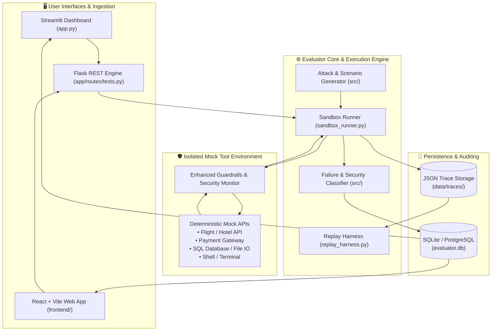

# 🛡️ Local-First Offline AI Agent Evaluator

> **Enterprise-Grade, Zero-Telemetry Evaluation Harness & Security Sandbox for Autonomous AI Agents**

[](https://www.python.org/downloads/)
[](LICENSE)
[]()
[]()
[]()

---

## 📖 Overview

The **Local-First Offline AI Agent Evaluator** is a secure, air-gapped testing and evaluation framework designed to benchmark, stress-test, and validate AI agents before production deployment. 

By operating **100% offline** with zero cloud telemetry dependencies, it provides a safe, deterministic sandbox where autonomous agents can execute complex multi-step workflows, tool calls, and edge-case scenarios without risking external data leakage, runaway cloud bills, or unintended real-world side effects.

---

## ✨ Key Features

| Capability | Description |
| :--- | :--- |
| 🔒 **Air-Gapped & Local-First** | Runs completely offline on local machines. Zero external API calls, zero telemetry, zero data exfiltration risks. |
| 🧰 **Deterministic Mock Tool Suite** | Built-in high-fidelity mock tools simulating Flight Bookings, Hotel Reservations, Payment Gateways, SQL Queries, File Systems, Shell/Terminal commands, and Email Services. |
| 🛡️ **Active Security Monitor & Guardrails** | Real-time heuristic and regex scanners detecting prompt injections, jailbreaks, shell escapes, privilege escalation, and automatic PII redaction (passwords, emails, phone numbers, credit cards). |
| ⚡ **Adversarial Attack & Scenario Generator** | Automated generation of fuzzing inputs, prompt injections, boundary-stressing inputs, and complex synthetic multi-step agent tasks. |
| 🧠 **Intelligent Failure & Security Classifier** | Automatic classification of agent failures (tool errors, hallucinated arguments, loop stalls) and security events via local Ollama models (e.g. `llama3`, `mistral`) or offline heuristic fallbacks. |
| 📊 **Dual User Experience** | **Streamlit Visual Studio** with 5 interactive analysis tabs + **Modern React/Vite Frontend** for live evaluations. |
| 💾 **Hybrid Storage Engine** | Zero-configuration **SQLite** database out of the box with optional **PostgreSQL** support for team environments. |
| 🔄 **Deterministic Trace & Replay Harness** | Complete step-by-step trace recordings with millisecond timestamps, argument diffs, and exact replay capability. |

---

## 🏗️ Architecture & Workflow



---

## 📁 Repository Structure

```text
agent-evaluator-hackathon/
├── app/                        # Flask Backend Service
│   ├── models/                 # Peewee ORM Models (Agent, TestRun, Scenario, Scorecard)
│   ├── routes/                 # REST API Endpoints (/api/run, /api/results, /api/scorecard, etc.)
│   ├── database.py             # Dual SQLite / PostgreSQL Database Driver
│   └── __init__.py             # Flask App Factory with CORS & Health Check
├── sandbox/                    # Local-First Sandbox & Mock Tool Core
│   ├── mock_tools.py           # Deterministic Mock APIs (Flight, Hotel, SQL, File, Payment, etc.)
│   ├── sandbox_runner.py       # Autonomous Agent Execution Engine
│   ├── security_monitor.py     # Real-time Security Event Interception
│   ├── enhanced_guardrails.py  # PII Redaction & Deep Argument Validation
│   ├── trace_storage.py        # Trace File Persistence & Indexing
│   └── replay_harness.py       # Deterministic Step-by-Step Replay
├── src/                        # Generators & Classification Intelligence
│   ├── attack_generator.py     # Adversarial Fuzzing & Jailbreak Prompts
│   ├── scenario_generator.py   # Synthetic Goal & Scenario Builder
│   ├── failure_classifier.py   # Agent Error Taxonomy Classifier
│   ├── security_classifier.py  # Threat & Vulnerability Detection
│   ├── orchestrator.py         # End-to-end Evaluation Workflow
│   └── ollama_client.py        # Local Ollama LLM Connector
├── frontend/                   # Modern React + Vite UI Application
│   ├── src/                    # Components, Hero Experience & Live Dashboards
│   └── package.json            # Node Dependencies
├── tests/                      # Automated Unit & Integration Test Suite
│   ├── test_mock.py            # Mock Tool Verification
│   ├── test_sandbox.py         # Sandbox Runner & Security Tests
│   ├── test_storage.py         # Trace Storage & Replay Tests
│   └── test_ollama.py          # Local LLM Integration Tests
├── app.py                      # Interactive 5-Tab Streamlit Dashboard
├── run.py                      # Flask API Server Entry Point
├── pyproject.toml              # Python Project Specification
├── requirements.txt            # Python Dependencies
└── .gitignore                  # Git Ignore Rules
```

---

## 🚀 Quickstart Guide

### 1. Prerequisites
- **Python 3.10+** (Python 3.11+ recommended)
- **Node.js 18+** (Optional, for the React frontend)
- *(Optional)* [Ollama](https://ollama.ai/) installed locally if you want local LLM classification.

### 2. Environment Setup

Clone the repository and install dependencies:

```bash
# Clone the repository
git clone https://github.com/imnaviya18/agent-evaluator-hackathon.git
cd agent-evaluator-hackathon

# Create and activate virtual environment
python -m venv .venv

# On Windows:
.venv\Scripts\activate
# On macOS / Linux:
source .venv/bin/activate

# Install dependencies
pip install -r requirements.txt
```

---

### 3. Running the Applications

#### Option A: Streamlit Interactive Dashboard (Recommended)
Launch the comprehensive evaluation console with 5 analytics tabs:

```bash
streamlit run app.py
```
> Navigate to `http://localhost:8501` to access:
> 1. **Test Runner**: Execute single or batch test scenarios.
> 2. **Reliability Scorecard**: Visual pass/fail metrics, error distribution, and latency curves.
> 3. **Security Matrix**: Intercepted injections, PII redactions, and safety compliance.
> 4. **Cost Savings & ROI**: Offline execution savings vs. commercial cloud evaluation APIs.
> 5. **Trace Explorer**: Step-by-step trace inspection and replay.

---

#### Option B: Flask REST API Backend
Run the local-first evaluation engine API:

```bash
python run.py
```
> Server runs on `http://127.0.0.1:5000` with automated SQLite table creation in `data/evaluator.db`.

---

#### Option C: React + Vite Frontend
Launch the modern web UI:

```bash
cd frontend
npm install
npm run dev
```
> Open `http://localhost:5173` in your browser.

---

## 🧪 Running Tests

Execute the full automated test suite offline:

```bash
pytest
```

Expected output:
```text
============================= test session starts =============================
collected 10 items

tests/test_mock.py ..                                                    [ 20%]
tests/test_ollama.py .s                                                  [ 40%]
tests/test_sandbox.py ..                                                 [ 60%]
tests/test_storage.py ....                                               [100%]

======================== 9 passed, 1 skipped in ~1.5s ========================
```

---

## 🔌 API Endpoints Reference

| Method | Endpoint | Description |
| :--- | :--- | :--- |
| `GET` | `/health` | Service health status and privacy metadata. |
| `POST` | `/api/run` | Trigger evaluation run for a target scenario or agent prompt. |
| `GET` | `/api/results` | Retrieve past test run histories and metrics. |
| `GET` | `/api/scorecard` | Aggregated reliability and security scorecards. |
| `GET` | `/api/scenarios/presets` | List built-in benchmark test presets. |
| `POST` | `/api/scenarios/generate` | Synthesize new adversarial or functional scenarios. |

---

## 🛡️ Security & Privacy Philosophy

1. **Zero External Egress**: No prompts, model weights, or tool arguments leave your workstation.
2. **Deterministic Sandboxing**: Tool interactions cannot touch your real filesystem or network unless explicitly whitelisted.
3. **Automatic PII Masking**: Email addresses, phone numbers, API keys, and credit cards are scrubbed from evaluation traces.
4. **Reproducible Audits**: Every decision step, latency metric, and tool return value is cryptographically hashed and saved in standard JSON.

---

## 👥 Contributors & Hackathon Team

- **Naviya** ([@imnaviya18](https://github.com/imnaviya18))
- **akaKRISH** ([@akaKRISH](https://github.com/akaKRISH))

---

## 📄 License

This project is licensed under the MIT License. See [LICENSE](LICENSE) for details.
